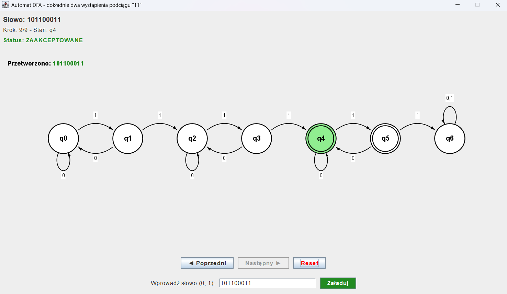

# DFA Visualizer

An interactive, step-by-step visualizer for a deterministic finite automaton (DFA), built in Java (Swing, Java2D). Enter a binary word and step through the automaton's transitions one at a time, watching the currently active state highlighted live.

> **Scope note:** this is a demo of one specific, hardcoded automaton - **not** a generic visualizer that loads any DFA from a file. The state/transition definitions (including the graph drawing itself) are hardcoded for this one automaton. This was a deliberate choice: the goal was to demonstrate DFA execution visually, not to build a general-purpose tool.



## The automaton

The automaton accepts binary words (alphabet `{0, 1}`) containing **exactly two occurrences** of the substring `"11"`.

- 7 states: `q0`–`q6`
- Accepting states: `q4`, `q5`
- `q6` is a trap state (a third occurrence of `"11"` → reject, no way back)

## Features

- Enter any binary word (input validation — only `0` and `1` accepted)
- Step-by-step navigation: **Previous / Next** buttons, current state highlighted
- Color-coded result once the whole word has been processed (accepted / rejected)
- Curved transition arrows (Bézier curves) and self-loops for transitions back to the same state
- Visual distinction for accepting states (double circle)

## Running it

Requires a JDK (tested on Java 21).

```bash
javac *.java
java DFAVisualizer
```

## Stack

- Java
- Swing (GUI)
- Java2D (`Graphics2D`, `QuadCurve2D` — drawing the automaton graph)

## Possible next steps

A natural next step would be generalizing the visualizer: loading any automaton definition from a file (JSON/text — states, transitions, accepting states) instead of hardcoding it, along with automatic state layout on the canvas.
